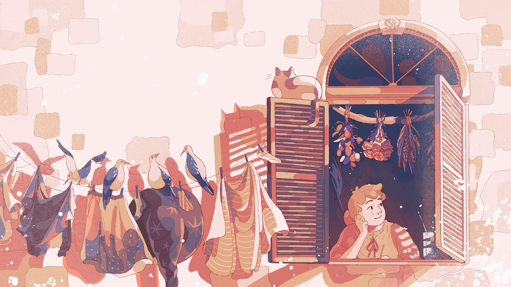

<a href="index.html"><< Back</a>
 

 
<figure class="fancy">
    
    <figcaption>Image of Koriko from <a href="https://mouseholepress.itch.io/koriko">https://mouseholepress.itch.io/koriko</a></figcaption>
  </figure>

### Intro to Koriko Solo Journaling TTRPG 

I recently came across a Solo Journalling TTRPG called **Koriko: A Magical Year** 

I have had a curiousity about Solo TTRPGs for a while but haven't come across one that I felt I wanted to try until this one. It looks so well put together, and is writing based, so I thought I might give it a try. 

I'm going to try doing the journalling on my site. I'll have the posts linked on an index page. But I have never done this before so it will be out of my comfort zone I guess lol 

First, some starting off info. 

**Title:**  Koriko: A Magical Year  
**Source:**  https://mouseholepress.itch.io/koriko    
**Cost:** US$18 for digital copy but there are usually free digital community copies available if you can't afford it. There is a physical version available but its sold out at time of me writing this.   

**Premise:** "a bubbling cauldron of simple rules and writing prompts, stirred together to produce the story of a teenage witch spending a year away from home in an unfamiliar city called Koriko. The game’s primary inspiration is Kiki’s Delivery Service, both the Studio Ghibli film and the Eiko Kadono novel"

**Requirements:**   
~ A Tarot Deck ([official digital alternative](http://screentop.gg/@mouseholepress/koriko))     
~ 21 six sided dice (or alternatively some tokens, which are easy to make yourself)   
~ a Journal of some kind. 

And the TTRPG Pack of course. 

<a href="index.html"><< Back to the Index</a>

  
 

