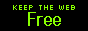
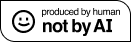

<h2>Welcome</h2>

Hi, I'm <rainbow-text>Starbug</rainbow-text>, a Queer Gen X woman who lives near Sydney in Australia. Welcome to my little space on the internet! Space Cadet is a personal site where I will throw random stuff and just do whatever. 

Some of my favourite things are: Reading, postcards, snailmail, movies, dandelions, bats, bees, citizen science, postcrossing, hopepunk, horror, weird things, and more. 

I log everything I read and watch on <a href="https://www.goodreads.com/user/show/21899-mysteriouspanda">Goodreads</a> and <a href="https://trakt.tv/users/spiderkitten">Trakt</a>

Check out my <a href="https://neocities.org/site/starbug">Neocities Profile</a> if you want to follow me there and don't forget to <a href="guestbook.html">sign my guestbook</a> before you leave!

<!-- grid to align quotes and rings-->

<!-- RECENT Stutter -->

## Latest Stutter

 

  <ul>
  
  
    <li><a href="{{ stutter.date }}"> {{ stutter.content }}</a></li>
  

<!--recentPostList-->

<!--bullets-->

<!--stutter-->

<!-- Quotes -->

<h3>Random Quote</h3>

 
 

--  

<button id="generate">refresh</button>

<!--quote-->

<!--randomquote-->

<!--
## Recent Blog Posts

  <ul>
  
  
    <li><a href="{{ post.url }}"> {{ post.data.title }}</a></li>
  

--> 

### Most Recent Site Change
 

 



<strong> {{ changes.date }}:</strong> {{ changes.update }}

  

<a href="changelog.html">Full Changelog</a>

<!-- -->

<!--changelog-->

<!-- WEBRINGS -->

<h3>Rings and Things</h3>
<!-- TF2 Webring -->

  
  

<!--No AI Webring-->

<map name="noaimini2">
<area href="https://baccyflap.com/noai" target="_blank" shape="rect" coords="5,3,83,14" alt="no ai webring" title="no ai webring">
<area href="https://baccyflap.com/noai/?prv&s=spc" target="_top" shape="rect" coords="5,16,16,26" alt="previous" title="previous">
<area href="https://baccyflap.com/noai/?rnd" target="_top" shape="rect" coords="38,16,51,27" alt="random" title="random">
<area href="https://baccyflap.com/noai/?nxt&s=spc" target="_top" shape="rect" coords="72,16,83,26" alt="next" title="next">
</map>

<!--NO AI webring-->

<!--textbox-->

<!-- buttons -->

     

<!--buttons-->

