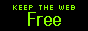
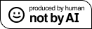

## Welcome

Hi, I'm <rainbow-text>Starbug</rainbow-text>, a Queer Gen X woman who lives near Sydney in Australia. Welcome to my little space on the internet! Space Cadet is a personal site where I will throw random stuff and just do whatever.

Some of my favourite things are: Reading, postcards, snailmail, movies, dandelions, bats, bees, citizen science, postcrossing, hopepunk, horror, weird things, and more.

I log everything I read and watch on <a href="https://www.goodreads.com/user/show/21899-mysteriouspanda">Goodreads</a> and <a href="https://trakt.tv/users/spiderkitten">Trakt</a>

Check out my <a href="https://neocities.org/site/starbug">Neocities Profile</a> if you want to follow me there and don't forget to <a href="guestbook.html">sign my guestbook</a> before you leave!

<!-- grid to align quotes and rings-->

  <!-- Quotes -->
    

      <h3>Random Quote</h3>
        

           
           
          
          
--  

          <button id="generate">refresh</button>
        
<!--quote-->
    
<!--randomquote-->

  <!-- WEBRINGS -->
  

    <h3>Rings and Things</h3>
      <!--No AI Webring-->
        

          <map name="noaimini2">
          <area href="https://baccyflap.com/noai" target="_blank" shape="rect" coords="5,3,83,14" alt="no ai webring" title="no ai webring">
          <area href="https://baccyflap.com/noai/?prv&s=spc" target="_top" shape="rect" coords="5,16,16,26" alt="previous" title="previous">
          <area href="https://baccyflap.com/noai/?rnd" target="_top" shape="rect" coords="38,16,51,27" alt="random" title="random">
          <area href="https://baccyflap.com/noai/?nxt&s=spc" target="_top" shape="rect" coords="72,16,83,26" alt="next" title="next">
          </map>
          
        
<!--NO AI webring-->
  
<!--textbox-->

<!--indexgrid-->

<!-- RECENT Stutter -->

  ## Latest

  #### Stutter 
  

      
      

<strong>{{ stutter.date }}:</strong> <a href="stutter.html">{{ stutter.content }}</a>
 
  
  

#### Blog Posts  

 
  
  

<strong>{{ post.date | dayMonthYear }}:</strong><a href="{{ post.url }}"> {{ post.data.title }}</a>
 
  

#### Site Update  

 



<strong> {{ changes.date }}:</strong><a href="changelog.html"> {{ changes.update }}</a>

  

<!-- -->

<!--textbox-->

<!--

### Most Recent Site Update
 

 



<strong> {{ changes.date }}:</strong> {{ changes.update }}

  

<a href="changelog.html">Full Changelog</a>

 

-->
<!--changelog textbox-->

<!-- buttons -->

     

<!--buttons-->

