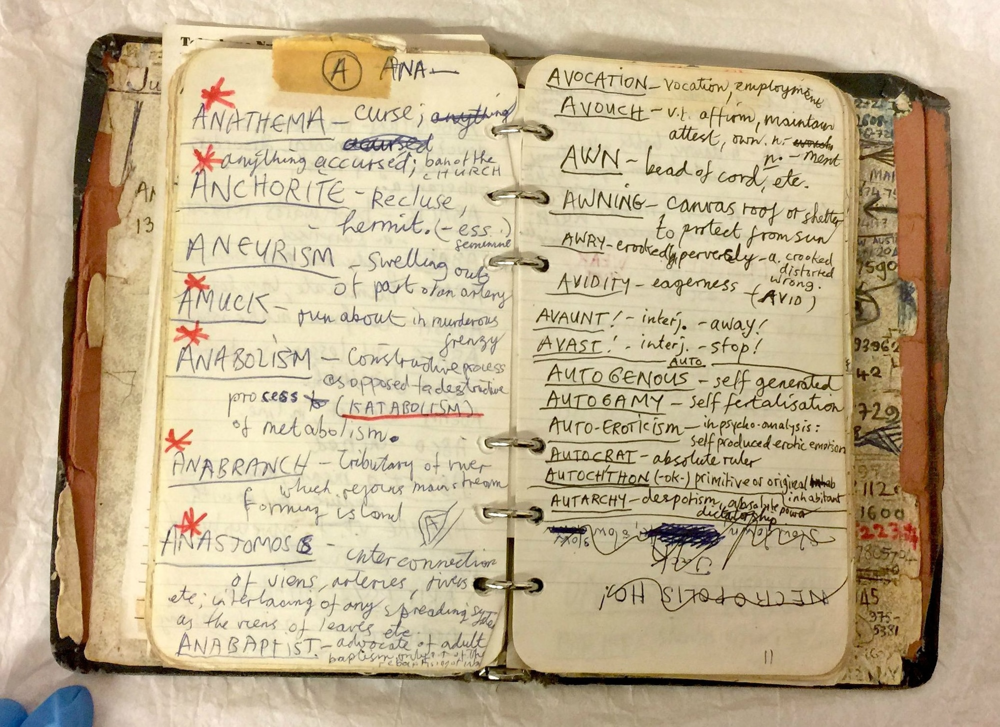

<h2>Book of Words</h2>

<h3>Info</h3>

Nick Cave of the band Nick Cave and the Bad Seeds kept a handwritten book of words in which he wrote down words he wanted to remember. Some photos of the book are available online to view, here is one of them:

  
<figure class="fancy">
  <figcaption>Photo of Nick Caves Book of Words</figcaption></figure>

I have always wanted to keep my own book of words, so this is me starting one I guess. Not much here yet but will build on it. Collected below will be words (And some phrases) I like, find interesting, have meaning or I might include them for some other reason. I may even use different fonts just to give the words some personality. We'll see how that goes. 

I'm including any word I like. Not all of them may appear in the dictionary. 

<h3>Lexicon</h3>
<h4>A-K</h4>

Bimble

to walk at a leisurely pace

Clowder

cluster of cats

Dendrophile

someone who loves trees

Frondescence

the unfurling of leaves

Grotesquerie

grotesque things collectively

Incandescent

emitting light, full of emotion

<h4>L-Z</h4>

Librocubicularist
 
someone who reads in bed

Lubberwort

16th Century, meaning: lazy, stupid person

Mellifluous

a pleasing sweet sound

Peiskos

Norwegian, meaning: the feeling of the coziness of an indoor fireplace

Petrichor

smell of rain when it falls on dry soil

Snuggery

a cosy or comfy place such as a den or small room

Thalassophile

someone who loves the sea

Tickeld Pink

idiom, meaning: very pleased

Wayfarer

Person who travels on foot

