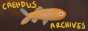

<h2>Links</h2>

Just a collection of sites I wanted to share. A work in progress!
 

    <a href="#neosites">Personal Sites</a> 
    <a href="#citsci">Citizen Science</a> 
    <a href="#books">Books/Reading</a> 
    <a href="#useful">Useful</a>  
    <a href="neocities.html">Site Making</a>  
 

 

  
 <!-- gifs start paused -->
      

        <button onclick="resumegifs()">play gifs</button> 
        <button onclick="freezegifs()">pause gifs</button>
        

        <small>(requires javacript)</small>
      

<!-- template 
 

<h2 id=" "> </h2>

<h3> </h3>

 
 
 

 -->

 <!-- ========== Neocities Sites ========== -->

  <!-- templates: 

 

 
 
 
 -->

<h2 id="neosites">Neocities / Nekoweb Sites</h2>

<h3><upsidedown>Down Under</upsidedown></h3>

Site run by other Aussies!

  

<a href="https://fcota.neocities.org/">Flower Children of the Apocalypse</a>

 

 <h3>Over 40s Club</a></h3>

Fellow oldies! Neocities sites run by people aged 40+
 
 

 
<h3>Sites I like</h3>
 <!-- template: 

 -->
 

            

<h3>Interesting Sites</a></h3>

<!--template
 

 
 
 
-->

 

 
 

 
 <a href="https://dailypokemoncrochet.neocities.org/">Daily Pokemnon Crochet</a>

 
Fan project to crochet and display all 1025 pokemon - at the time of me adding this link, they are up to 728! 
 

 
<a href="https://dreambubble.neocities.org/garden">Learn to Garden</a>

 
a beginners guide to gardening
 

 
<a href="https://anemptyblissbeyondthisworld.neocities.org/music/disco">Beginners Guide to Disco</a>

 
a well written guide to the history of Disco music
 

 
<a href="https://onnade.neocities.org/">In Women's Hands: Transmitting the Literature of Heian Japan</a>

about women writers and readers in Japanese art
 

 
<a href="https://bugstamp.net/">Daniel's Bug Stamp Collection</a>

 
A collection of postage stamps that feature bugs
 

 
 

<a href="#top">top <i class="arrow up"></i></a>

    
     
    

 <!-- ========== CITIZEN SCIENCE ========== -->
 <!-- template

 
 
 
-->

<h2 id="citsci">Citizen Science</h2>
 
Note that you normally do NOT have to reside in the country the program is based in, most of these are open globally. I've just seperated them because I'm in Australia and wanted a special category for those. 

<h3>Australia Based</h3>

<a href="https://volunteer.ala.org.au/">Digivol Australia</a>
 

transcribe botanical plates, ID animals in photos etc for the Australian Museum and the CSIRO

<a href="https://inaturalist.ala.org.au/">inaturalist</a>

Contribute photos and locations of flora and fauna, particpte in projects, help ID photos etc

<a href="https://transcribe.naa.gov.au/">National Archives</a>

transcribe historical documents

<a href="https://www.sl.nsw.gov.au/research-and-collections/research-and-engagement/digital-volunteering">State Library of NSW</a>

transcribe audio tapes, historical documents etc

 <h3>US Based</a></h3>

<a href="https://www.zooniverse.org">Zooniverse</a>

lots of projects to help out with from identifying animals in photos to transcribing documents and more.

<a href="https://www.pgdp.net/c/">Distributed Proofreaders</a>

transcribe scanned public domain books for Project Gutenberg. This one is super organised with mentors.

<a href="https://transcription.si.edu">Smithsonian Digital Volunteers</a>

lots of projects to transcribe historical documents

<a href="https://fromthepage.com/findaproject">From the Page</a>

transcribe historical documents from Archives and Libraries
 

<a href="#top">top <i class="arrow up"></i></a>

<!--============BOOKS==========-->

<h2 id="books">Books</h2>

<h3>books</a></h3>

<a href="https://howlongtoread.com/">How Long to Read</a>

 
do a reading test to find your reading speed, then for any book you enter it will tell you approx how long it will take you to read it.

 
<a href="https://qbdatabase.wpcomstaging.com/">Queer Books Database</a>

 
a free, public, searchable database listing queer rep in books
 

 
<a href="https://figcat.com/">Figcat</a>

 
a repository of lists of books compiled by hand from various sources. Some are super niche lists, for example "Metaphysical detective stories and other literary mysteries" and "Epics, picaresques, and proto-novels: narrative fiction up to 1700"
 

 
<a href="#top">top <i class="arrow up"></i></a>

<!-- ========== USEFUL ========== -->

<!-- template

 
 
 
-->

<h2 id="useful">Useful Sites</h2>

<h3>assorted</h3>

 

<a href="https://temp-mail.org/en/">Temp Email</a>

 
get a temporary/throwaway email that exists only as long as the browser page is open. Super useful when you need to give an email adress to access something and don't want to end up on a mail list.
 

 

<a href="https://www.explainxkcd.com/wiki/index.php?title=Main_Page">Explain XKCD</a>

 
if you enjoy the XKCD webcomic and find that occasionally they go over your head, this site will explain them
 

 

<a href="https://www.abrathatfits.org/calculator.php">A Bra That Fites calculator</a>

 
created by the awesome people over at /r/ABraThatFits on reddit to help you find your bra size
 

<a href="https://cobalt.tools/">cobalt.tools</a>

 
site that lets you save media from instagram, tiktok and some other sites
 

<a href="https://randombundlegame.com/">Bundle Browser</a>

 
if you have ever bought a bundle from itch.io that supports a cause (for example the Queer Games Bundle) then you know how many games/TTRPGs you have to sort through. With the bundle browser you can browse and filter them easily
 

 
<a href="#top">top <i class="arrow up"></i></a>

<!-- end freeze-->

 <!-- end of section -->
</section>