  
 <!-- gifs start paused -->

## Exit Portals

Sites that are hosted on Neocities, Nekoweb, or that just fit the aesthetic of the Small/Indie Web. 

  <!-- play/pause buttons (needs the freeze div above) -->
  

    <button onclick="resumegifs()">play gifs</button> 
    <button onclick="freezegifs()">pause gifs</button>
    

    <small>(requires javacript)</small>
  

<!-- template 

-->

<h3>Down Under</h3>

Sites run by other Aussies! 

  <a href="https://caffeineandlasers.com">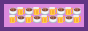</a> <a href="https://uuupah.neocities.org/">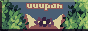</a> 

<a href="https://fcota.neocities.org/">Flower Children of the Apocalypse</a> (band)

 

### Over 40s Club  

Fellow oldies! Neocities sites run by people aged 40+ 
 

### Game Dev Sites   
 People who make games! check their games out! 

<a href="https://dinosire.com">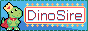</a>
 

 
<h3>Button Wall</h3>

 

<a href="https://petrapixel.neocities.org/">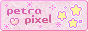</a>   <a href="https://notprincehamlet.neocities.org/">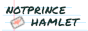</a>    <a href="https://its-priestess.neocities.org/">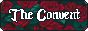</a> <a href="https://steponleaf.neocities.org/">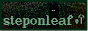</a>  <a href="https://gusbus.space/smallweb-subway/">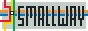</a> <a href="https://caehdus.neocities.org/">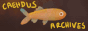</a> <a href="https://blamensir.neocities.org/">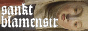</a> <a href="https://bearlythere.neocities.org/">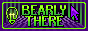</a> <a href="https://mioasis.neocities.org/">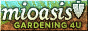</a> <a href="https://ughbees.neocities.org/">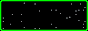</a>  <a href="https://espy.world">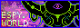</a>

### Buttonless but still cool 

<ul>
<li><a href="https://dreambubble.neocities.org/garden">Learn to Garden</a></li>
<li><a href="https://anemptyblissbeyondthisworld.neocities.org/music/disco">Beginners Guide to Disco</a></li>
<li><a href="https://onnade.neocities.org/">In Women's Hands: Transmitting the Literature of Heian Japan</a></li>
<li><a href="https://bugstamp.net/">Daniel's Bug Stamp Collection</a></li>

<li><a href="https://claraisknitting.neocities.org">Clara Is Knitting</a></li>

</ul>

<a href="#top">top <i class="arrow up"></i></a>

<!-- end freeze-->

